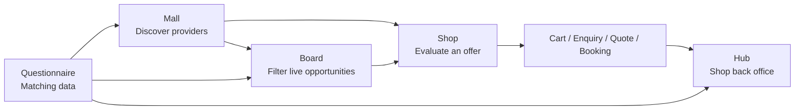
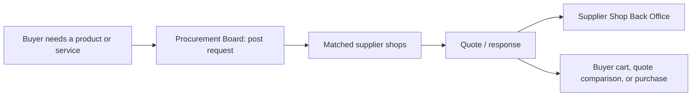

# Mall vs Board vs Back Office

## Mall, Board, Hub, and Questionnaire

Yes, I think the concepts are currently mixed, and your distinction is the right one.

A **Mall** and a **Board** serve different commercial purposes:

| Concept | What it is | Primary content | Member action |
|---|---|---|---|
| **Mall** | A marketplace or directory of member businesses | Shops, service providers, products, capabilities, lender profiles | Discover a business and send an enquiry, request a quote, or transact |
| **Board** | A live exchange of commercial opportunities | Loads, storage requirements, funding requests, procurement requests, available capacity | Post, search, respond to, bid on, or match an opportunity |
| **Hub** | The member’s own management area | Their shop, listings, profile, fleet, products, applications, or posts | Create and maintain their commercial presence |
| **Questionnaire** | Matching and qualification data | Operating profile, requirements, capacity, credit policy, routes | Supply data so the platform can make relevant matches |

So your example is exactly right:

- **Supplier Mall**: collection of supplier shops and service providers.
- **Transport Mall**: collection of transporter/fleet businesses.
- **Warehouse Mall**: collection of warehouse businesses and available services.
- **Finance Mall**: collection of finance-provider profiles and products.
- **Loads Board**: live freight opportunities posted by shippers or brokers, matched to available carrier capacity.

I would challenge the current use of **Loads Mall**. Loads are not naturally a collection of shops. They are time-sensitive jobs or instructions. Calling it a mall makes users expect a supplier-style directory, when they really need a freight exchange or opportunity board.

My recommended naming model:

- `Supplier Mall`
- `Transport Mall`
- `Warehouse Mall`
- `Finance Mall`
- `Buy & Sell Mall`
- `Loads Board` or, if you want a more commercial name, `Freight Exchange`

Then define the supporting boards that may exist inside or alongside each mall:

- **Supplier Mall** can have a `Procurement Board` for buyers posting product/service requirements.
- **Transport Mall** can have a `Capacity Board` for transporters publishing available backhaul or fleet capacity.
- **Warehouse Mall** can have a `Storage Board` for available capacity and storage requests.
- **Finance Mall** can have a `Funding Board` for finance applications or funding opportunities.
- **Loads Board** remains the central place for available loads and carrier responses.

The important product rule is:

> A mall answers “Who can provide this?”  
> A board answers “What opportunity is available right now?”  
> A hub answers “What is my business offering or managing?”  
> A questionnaire answers “What information does the platform need to match me well?”

This structure also makes your monetisation clearer. A member may pay for:

- **Mall access** to discover businesses and receive discovery leads.
- **Board access** to see and respond to live commercial opportunities.
- **Hub access** to publish their shop, capacity, products, or listings.
- **Additional role access** to operate another business type within the same company.

I would avoid treating a mall pathway as one indivisible feature. The member’s real value may differ:

- A supplier may want a **Supplier Mall shop** but not a Procurement Board.
- A transporter may want the **Loads Board** but not a Transport Mall storefront.
- A warehouse may need the **Storage Board** and Warehouse Mall profile.
- A financier may want a **Funding Board** of qualified applications plus a Finance Mall profile.

That is the conceptual cleanup I would make before changing navigation or membership packaging further. The app should be organised around these four surfaces: **Malls, Boards, Hubs, and Questionnaires**.

## Loads Mall and Loads Board

That is a valid challenge. If a member must register a shop to publish and sell loads, there is a real marketplace behind it. The distinction is not whether sellers exist, but what the user is trying to do at a given moment.

A freight broker or shipper can have a **Load Shop**:

- Presents the business, operating lanes, commercial terms, credibility, and service history.
- Lets a carrier assess who is offering work before engaging.
- Creates a vendor presence that can generate recurring relationships.

Then the same broker can publish individual **Load Listings**:

- Origin, destination, dates, equipment, weight, rate, constraints, and status.
- Time-sensitive and frequently changing.
- Designed to be searched, filtered, matched, and responded to.

So I would revise my earlier statement: the Loads concept can absolutely have a mall component. The issue is simply that a single label, `Loads Mall`, currently has to cover two different user intents.

Your interpretation of a **Board** is also right: it is primarily a query-driven working surface that returns a live, filterable list of opportunities. It does not imply that there are no vendors or shops behind those listings.

A clearer conceptual model could be:

| Surface | Loads example |
|---|---|
| **Loads Mall** | Directory of verified load providers, brokers, and transport buyers with public Load Shops |
| **Loads Board** | Searchable, time-sensitive list of individual available loads |
| **My Load Hub** | The member’s private workspace to manage their Load Shop, create listings, view responses, and track activity |
| **Questionnaire** | Fleet capacity, lanes, cargo restrictions, and matching preferences |

The same pattern can apply elsewhere:

- **Supplier Mall**: supplier shops.
- **Procurement Board**: current requests for parts, products, or services.
- **Transport Mall**: transporter/fleet shops.
- **Capacity Board**: currently available vehicles, backhauls, or lanes.
- **Warehouse Mall**: warehouse shops.
- **Storage Board**: immediate available capacity and storage requests.
- **Finance Mall**: finance-provider shops and lending products.
- **Funding Board**: current funding applications or qualified lending opportunities.

That creates a useful UI hierarchy:

1. A member starts in a **Mall** when they want to identify or evaluate a provider.
2. A member uses a **Board** when they want to search current opportunities by criteria.
3. A member enters a **Hub** when they want to manage their own shop and listings.

For Loads specifically, I would keep `Loads Mall`, but make its workspace cards explicit:

- **Search Load Board**  
  “Find currently available freight matched to your fleet, route, and capacity.”

- **Explore Load Shops**  
  “Review verified brokers and freight providers for recurring commercial relationships.”

- **My Load Hub**  
  “Create and manage your Load Shop, publish loads, and handle carrier responses.”

This is slightly more than the earlier two-card pattern, but for Loads it is justified. It makes the marketplace and board aspects visible instead of forcing one term to do all the work.

## Shop and Shop Back Office

Yes. I agree with this framework, and it is stronger than treating the Hub as a separate generic surface.

The flow becomes:

1. **Mall: discovery and trust**
   - Members start here to evaluate verified providers.
   - They view the shop, offering, capability, pricing or terms, trust signals, and service coverage.
   - The question being answered is: “Who should I do business with?”

2. **Board: opportunity aggregation and filtering**
   - A board is a market view across shops and members.
   - It aggregates live items such as available loads, capacity, product requests, storage needs, funding applications, or offers.
   - The question being answered is: “What current opportunity meets my criteria?”

3. **Shop: the commercial front office**
   - Each member’s public commercial presence in a Mall.
   - It is created and maintained through the Shop Wizard.
   - It displays the provider’s offer: products, capacity, lending products, loads, terms, compliance evidence, and contact or transaction paths.
   - The question being answered is: “What does this provider sell, and can I trust them?”

4. **Hub: the Shop Back Office**
   - Not a separate kind of shop. It is the owner-only operational layer of the existing shop.
   - It should be reached from the Shop Wizard or a `Manage Shop` action.
   - It contains incoming leads, enquiries, quote requests, accepted opportunities, carts/orders, fulfilment activity, transaction status, and performance.
   - The question being answered is: “What work has come to my shop, and how do I execute it?”

5. **Questionnaire: matching intelligence**
   - Private structured inputs that improve what a member sees in the Mall or Board, and which opportunities reach their Shop.
   - The question being answered is: “What should the platform know to match this business accurately?”

That gives you a clean commercial loop:

For the examples you gave:

| Domain | Mall / Shop | Board | Hub / Shop Back Office |
|---|---|---|---|
| Loads | Load-provider shops selling freight opportunities | Live load listings, filtered by lane, dates, equipment, and rate | Published loads, carrier responses, accepted matches, commercial execution |
| Supplier | Supplier shops with catalogue, terms, stock model, and delivery coverage | Procurement requests and potentially promoted products | Product catalogue, incoming carts/orders, quotes, fulfilment, customer enquiries |
| Transport | Transporter shops showing fleet, routes, equipment, and commercial terms | Available capacity, backhauls, and transport requests | Fleet availability, enquiries, load responses, accepted work, execution |
| Warehouse | Warehouse shops showing storage, handling, location, and rates | Storage requests and immediate capacity opportunities | Capacity updates, enquiries, bookings, fulfilment status |
| Finance | Lender shops showing products, criteria, credit policy, and terms | Qualified funding applications or funding opportunities | Applications received, underwriting workflow, offers, accepted deals |

The important terminology rule is:

> **Shop** is the member’s public offer.  
> **Hub** is that shop’s private back office.  
> **Mall** is the trusted collection of shops.  
> **Board** is the cross-shop, queryable view of live opportunities.  
> **Questionnaire** is the matching data that connects the right members, offers, and opportunities.

I would therefore change the earlier “My Fleet Hub”, “My Supplier Hub”, and similar wording over time to **Manage Shop** or **Shop Back Office**. “Hub” remains useful inside the owner experience, but it should always be visibly tied to the shop it operates, for example:

- `Acme Transport Shop Back Office`
- `ABC Spares Shop Back Office`
- `XYZ Finance Shop Back Office`

That removes the ambiguity between a public commercial presence and the private workspace used to run it.

## Module Completion Programme

You are right. “Over time” was vague and not useful. We should either define a phased implementation now, with clear completion criteria, or leave the current wording as-is. There should not be an undefined later.

I recommend we treat this as a deliberate module-completion programme:

1. **Finish the commercial language and entry structure now**
   - Keep **Mall** as the entry point.
   - Rename each workspace’s second card from `My [X] Hub` to `Manage Shop`.
   - Use supporting wording: “Manage your public offer, enquiries, transactions, and fulfilment.”
   - For Loads: `Manage Load Shop`.
   - For Finance: `Manage Finance Shop`.
   - Do not change routes yet; this is terminology and guidance only.

2. **Finish the Shop Back Office module**
   - Make the existing Shop Wizard clearly responsible for creating and editing the public shop.
   - Add or consolidate a clearly named owner-only `Shop Back Office` view.
   - It should show the work arriving at the shop: enquiries, quotes, orders/carts, accepted opportunities, listings, fulfilment status, and basic performance.
   - This is complete only when an owner can see and act on the commercial activity for their shop without searching through unrelated account menus.

3. **Finish the Board module**
   - Define each board as a queryable live listing surface, not a shop directory:
     - Loads Board
     - Procurement Board
     - Capacity Board
     - Storage Board
     - Funding Board
   - Start with the **Loads Board**, since you are paying to validate it now.
   - Complete it when a transporter can find a load, review the originating Load Shop, respond, and the response appears in the provider’s Shop Back Office.

4. **Finish the Mall-to-Board-to-Shop loop**
   - From a Mall, a member can inspect a Shop.
   - From a Board, a member can inspect both the listing and the originating Shop.
   - From a Shop, a member can start the correct commercial action.
   - That action appears in the owner’s Shop Back Office.
   - This is the first fully closed commercial loop and the template for other malls.

5. **Then move to the next domain**
   - Apply the proven pattern to Supplier first, then Transport, Warehouse, and Finance.
   - Do not rename or add routes casually after the module is marked complete; changes should be driven by a specific defect or commercial requirement.

The immediate action I would take is Phase 1: change the visible labels in the two-card mall workspaces now from `My [X] Hub` to `Manage [X] Shop`, with the back-office explanation. This is narrow, consistent with the final architecture, and does not disturb the current routes or underlying modules.

## Procurement Board

A **Procurement Board** is a live, searchable list of current buying requirements. It is not a directory of suppliers.

A member uses it when they need to buy something and want suitable suppliers to respond. For example:

- “Need 12 315/80 R22.5 tyres delivered to Johannesburg this week.”
- “Looking for a workshop to service five trailers in Durban.”
- “Require OEM brake parts for a specified fleet.”
- “Need fuel-card options for 40 vehicles.”
- “Seeking a supplier for refrigerated-body repairs.”

The buyer posts a request containing:

- Product or service required
- Quantity or scope
- Specification, compatible brand, or quality requirement
- Delivery location
- Required date
- Budget range or request-for-quote basis
- Credit, warranty, or compliance requirements

Verified supplier shops then see relevant requests and can respond with a quote, lead time, terms, or clarification request.

The commercial flow is:

The difference from the **Supplier Mall** is:

| Supplier Mall | Procurement Board |
|---|---|
| “Which supplier should I consider?” | “Who can fulfil this requirement now?” |
| Browse verified supplier shops and catalogues | Search or post immediate buying requests |
| Supplier-led: the supplier publishes its standing offer | Buyer-led: the buyer publishes a current requirement |
| Good for recurring discovery and trust | Good for urgent, specific, or competitive requirements |

It also gives suppliers a more valuable reason to subscribe: their shop is not merely a passive directory entry. The Procurement Board can send them qualified purchase opportunities that match their categories, coverage, stock model, terms, and delivery capability from their questionnaire and shop profile.

In the current architecture, this would become the board attached to the Supplier Mall. It should only be built once the Supplier Mall and Supplier Shop Back Office have been clearly completed, using the Loads Board flow as the template.